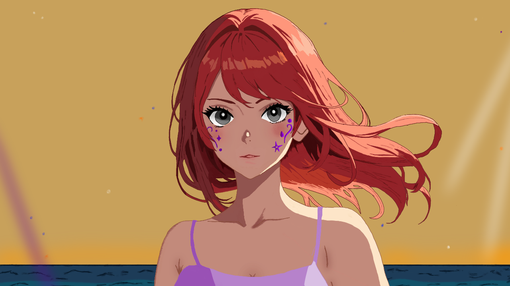

# Shadows On The Sands

<html>
<body>

An immersive mystery set in Umi Grill, a bustling beachside restaurant owned by the shrewd manager Mr. Matsu.

After you secure a job as a part-time host at the restaurant, you spend the following days interacting with your coworkers, making crucial choices, and meeting interesting characters in your new city as you strive to unravel the secrets which may be lurking beneath the surface of your workplace.

With teamwork and wit, will you uncover the truth and serve justice to the shores?

<b>Developed by</b>: Riya H

<b>Writing by</b>: Riya H

<b>Artwork by</b>: Riya H

<b>Music by</b>: Riya H and Sahyan Fareedi Ahmed

<ul><b>Technologies:</b>
  <li>Programming languages: Python</li>
  <li>Engines: Ren'Py</li>
  <li>Digital Artwork: GIMP, Autodesk Sketchbook</li>
  <li>Music Production: LMMS</li>
</ul>

<i>This repository contains some of the game's source code files and assets. All files are the sole property of the developer and cannot be replicated.</i>

</body>
</html>
